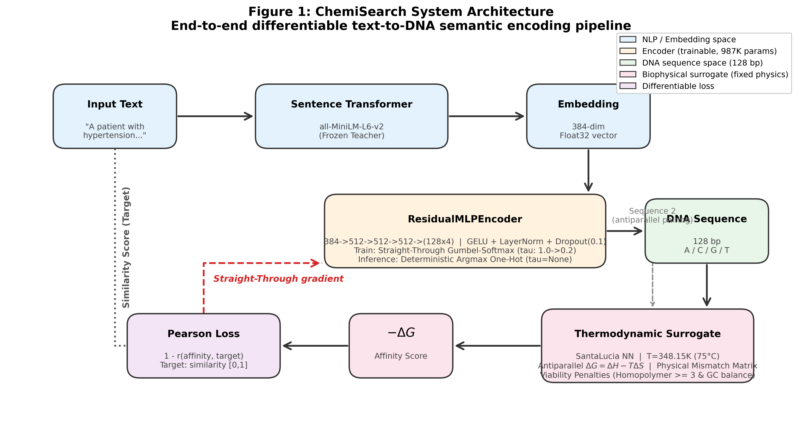

# A Computational Framework for Mapping Natural Language Semantics to DNA Hybridization Thermodynamics


**ChemiSearch** is an *in silico* end-to-end differentiable computational framework designed to map natural language semantics directly into DNA duplex hybridization thermodynamics.

## 📖 Abstract
DNA data storage has emerged as a promising technology for ultra-high-density, long-term information archiving. However, conventional molecular storage schemes treat DNA purely as a digital bit-container, mapping binary strings to nucleotides while disregarding the physical thermodynamics of molecular interaction. Consequently, performing native, content-based or semantic information retrieval directly within the biochemical domain remains an open challenge.

In this study, we present **ChemiSearch**, a differentiable neural-biophysical framework designed to map dense textual semantics into DNA duplex hybridization thermodynamics. Rather than relying on discrete digital indexing or hash tables, our architecture couples a residual neural encoder to a biophysical surrogate model based on SantaLucia unified nearest-neighbor thermodynamic parameters. During training, a **Straight-Through Gumbel-Softmax** bottleneck is employed, while evaluation uses **deterministic argmax one-hot projection** to guarantee exact, reproducible nucleotide generation. The network optimizes 128-bp DNA sequences such that semantic proximity in sentence embedding space translates into physical hybridization affinity ($-\Delta G$) in antiparallel molecular duplexes ($5' \to 3'$ bound to $3' \to 5'$).

Trained on Semantic Textual Similarity (STS-B) and Natural Language Inference (AllNLI) corpora, the model is evaluated on held-out in-domain test pairs (STS-B test) and three zero-shot cross-domain benchmarks: biomedical (BIOSSES), commonsense (SICK-R), and cross-lingual (STS17). The results demonstrate that differentiable biophysical sequence optimization establishes positive rank alignment with human semantic judgments above random baselines. Crucially, our empirical and ablation analyses characterize the fundamental trade-off between unconstrained digital vector spaces and non-linear thermodynamic energy surfaces, providing a foundational baseline and methodology for molecular semantic retrieval.

## 🔬 System Architecture


## 📊 Key Highlights & Contributions
- **End-to-End Differentiable Thermodynamics:** Integrates SantaLucia nearest-neighbor thermodynamic parameters ($\Delta G = \Delta H - T\Delta S$) and direct physical base-pair mismatch penalties directly into the neural network training objective.
- **Physical Antiparallel Duplexing:** Formulates duplex binding under strict biophysical antiparallel orientation ($5' \to 3'$ against $3' \to 5'$), enforcing true Watson-Crick complementarity and realistic mismatch mechanics.
- **Deterministic Inference & Straight-Through Discretization:** Employs Straight-Through Gumbel-Softmax categorical sampling during training and exact deterministic argmax one-hot projection during evaluation, eliminating test-time stochasticity.
- **Biological Viability Constraints:** Incorporates differentiable homopolymer penalties (>= 3 base runs) and quadratic GC-content balance regulation (40-60% optimal window) to ensure generated sequences remain viable for downstream *in vitro* synthesis.
- **Transparent Multi-Domain Evaluation:** Evaluates in-domain held-out generalization alongside zero-shot transfer across biomedical, commonsense, and cross-lingual domains, honestly detailing the physical bounds of molecular semantic search.

## 📈 Evaluation Results

### 1. Baseline Performance (STS-B In-Domain Test Set, n=1,379)
| Rank | Method | Spearman $\rho$ | Category | Description |
|:---:|---|:---:|---|---|
| 1 | Float32 Teacher | 0.8203 | Upper Bound | Dense continuous sentence embeddings (all-MiniLM-L6-v2) |
| 2 | Int8 Quantisation | 0.8203 | Digital Compression | 8-bit uniform scalar quantization |
| 3 | Binary Quantisation | 0.8086 | Digital Compression | 1-bit sign-thresholded embedding |
| 4 | LSH Hashing (256-bit) | 0.7963 | Digital Compression | Locality-sensitive Gaussian random projections |
| **5** | **ChemiSearch (Ours)** | **0.0730** | **Biophysical** | **Differentiable thermodynamic affinity ($-\Delta G$)** |
| 6 | Random DNA | -0.0211 | Lower Bound | Uniformly random 128-bp nucleotide sequences |

> **Biophysical vs. Digital Trade-off:** While digital compression schemes operate in high-dimensional vector spaces and preserve high linear rank correlation ($\rho \approx 0.80$), ChemiSearch optimizes physical molecular binding affinity ($-\Delta G$) constrained by nearest-neighbor thermodynamics and mismatch penalties. This introduces severe non-linear physical constraints, illustrating the challenging gap between abstract digital computation and native biochemical hybridization.

### 2. Multi-Domain & Zero-Shot Generalisation
| Dataset | Domain | Split Type | n | Spearman $\rho$ | p-value |
|---|---|---|:---:|:---:|:---:|
| **STS-B** | General | In-Domain (Held-Out) | 1,379 | +0.0730 | 3.36e-03 |
| **SICK-R** | Commonsense | Zero-Shot Transfer | 9,927 | +0.0409 | 4.62e-05 |
| **BIOSSES** | Biomedical | Zero-Shot Transfer | 100 | -0.0919 | 3.63e-01 |
| **STS17** | Cross-Lingual | Zero-Shot Transfer | 250 | -0.1522 | 1.60e-02 |

> **Scientific Analysis & Domain Adaptation:** The model exhibits statistically significant positive correlation on general in-domain pairs and commonsense sentences. However, zero-shot transfer to specialized PubMed biomedical sentences (BIOSSES) and cross-lingual pairs (STS17) demonstrates weak or inverted correlation, indicating that direct physical transfer without domain-specific biophysical fine-tuning remains an open challenge.

### 3. Biophysical Component Ablation (STS-B In-Domain Test)
| Variant | STS-B Test $\rho$ | Impact & Interpretation |
|---|:---:|---|
| **No Mismatch Penalty** | 0.2271 | Relaxing non-smooth physical mismatch penalties smooths the gradient optimization landscape |
| **No Bio Constraints** | 0.0992 | Removing homopolymer (>= 3) and GC-content balance constraints allows freer sequence optimization |
| **Full Model (ChemiSearch)** | 0.0730 | Balanced physical model with strict mismatch penalties and biological viability constraints |
| **No Residual Blocks (Linear)** | -0.0097 | Shallow 2-layer linear projection fails to bridge continuous sentence space to sequence space |
| **Random DNA Baseline** | -0.0211 | Stochastic noise lower bound |

## 📂 Visualizations and Artifacts
All figures are programmatically rendered and exported to the [figures/](figures/) directory:
- **[Figure 1](figures/fig1_architecture.png)**: End-to-end differentiable antiparallel architecture with deterministic evaluation.
- **[Figure 2](figures/fig2_baselines.png)**: Semantic preservation: digital compression vs. biophysical hybridization.
- **[Figure 3](figures/fig3_zero_shot.png)**: Semantic alignment across in-domain and zero-shot benchmark domains.
- **[Figure 4](figures/fig4_bio_validity.png)**: GC-content distribution and mutational error robustness analysis.
- **[Figure 5](figures/fig5_ablation.png)**: Systematic biophysical ablation study isolating component contributions.
- **[Figure 6](figures/fig6_comprehensive_comparison.png)**: Comprehensive visual comparison tables and summaries.

## ⚙️ How to Run
This repository provides a self-contained, reproducible pipeline optimized for **Kaggle** (GPU T4x2 or P100) or any standard GPU-enabled environment:
1. Clone this repository:
   ```bash
   git clone https://github.com/labonysur-cloud/DNA-Based-Semantic-Search.git
   cd DNA-Based-Semantic-Search
   ```
2. Upload `DNA_Based_Semantic_Search.ipynb` to Kaggle (or open locally in Jupyter).
3. Ensure internet connectivity is enabled to download HuggingFace datasets and teacher model weights.
4. Execute all cells sequentially. The pipeline includes automatic checkpointing and resumption.

## 📜 Citation
*(Paper under preparation for Journal Submission)*
```bibtex
@article{sur2026chemisearch,
  title={A Computational Framework for Mapping Natural Language Semantics to DNA Hybridization Thermodynamics},
  author={Sur, Labony},
  journal={In Preparation},
  year={2026}
}
```
